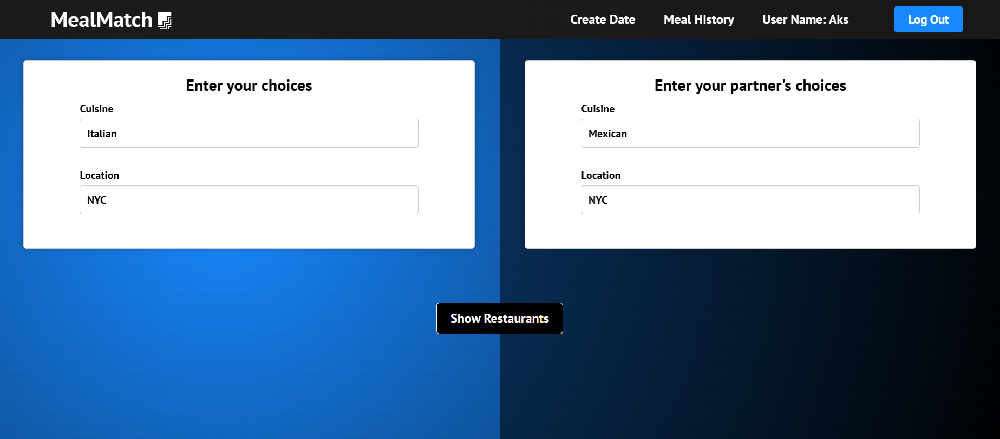
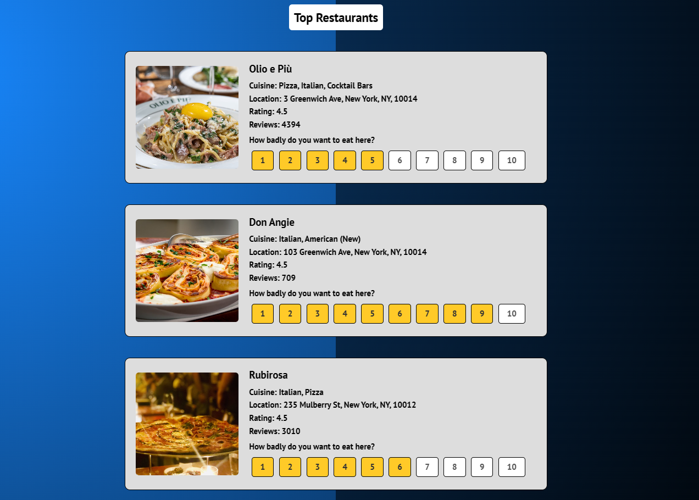

# MealMatch

This application facilitates the collaborative decision-making process between two individuals in selecting a dining venue.

The initial user logs in and inputs their and the other person's preferred cuisine options, along with the desired location. The application presents a list of highly-rated restaurants that align with both cuisine preferences. The user then rates these restaurants and can share the resulting link with the second person, who subsequently rates their own preferred options. The restaurant with the highest overall desirability rating is ultimately chosen as the preferred dining destination.

## How to set up Yelp API key
Generate an API key from Yelp Developers

Create .env file 

Name your variable REACT_APP_API and store the API key 

REACT_APP_API=api_key_here (replace api_key_here with your actual key)

## Images
### Enter Choices:

### Rate Restaurants:

### Hosted URL: 
https://anahar1.github.io/meal-match/

### Built with:
React and Firebase

### Contributers:
Anish Nahar, Akshay Reddy Kola

This project was made as a submission in the Lighthall Software Engineering Super League 1 - Level 4.